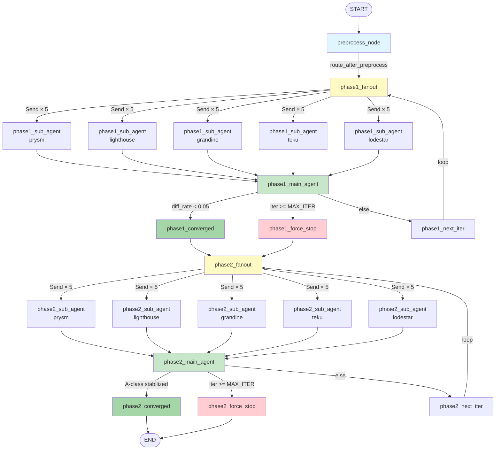

# EthAuditor — System Architecture Document

## 1. Global State Dictionary (`GlobalState`)

The `GlobalState` is a `TypedDict` that flows through the entire LangGraph pipeline.
Below is the complete field specification.

### Field Definitions

| Field | Type | Default | Writers | Readers |
|-------|------|---------|---------|---------|
| `current_phase` | `int` | `0` | `preprocess_node`, routers | All nodes |
| `phase1_iteration` | `int` | `0` | `router_phase1`, `phase1_next_iter` | Phase 1 nodes, router |
| `phase2_iteration` | `int` | `0` | `router_phase2`, `phase2_next_iter` | Phase 2 nodes, router |
| `guards` | `list[dict]` | `[]` | `phase1_main_agent` | Phase 1/2 sub-agents, writer |
| `actions` | `list[dict]` | `[]` | `phase1_main_agent` | Phase 1/2 sub-agents, writer |
| `vocab_version` | `int` | `0` | `phase1_main_agent` | Phase 1 sub-agents, router |
| `diff_rate` | `float` | `1.0` | `phase1_main_agent` | `router_phase1` |
| `client_lsgs` | `dict[str, dict]` | `{}` | `phase2_sub_agent` (merge) | `phase2_main_agent`, writer |
| `diff_report` | `dict` | `{}` | `phase2_main_agent` | `router_phase2`, writer |
| `logic_diff_rate` | `float` | `1.0` | `phase2_main_agent` | `router_phase2` |
| `a_class_count` | `int` | `-1` | `phase2_main_agent` | `router_phase2` |
| `prev_a_class_count` | `int` | `-1` | `phase2_next_iter` | `router_phase2` |
| `iteration_history` | `list[dict]` | `[]` | `phase2_main_agent` (merge) | `router_phase2`, writer |
| `converged_phase1` | `bool` | `False` | `router_phase1` | Graph routing |
| `converged_phase2` | `bool` | `False` | `router_phase2` | Graph routing |
| `force_stopped` | `bool` | `False` | Routers | Exit nodes |
| `preprocess_done` | `bool` | `False` | `preprocess_node` | Router |
| `preprocess_status` | `dict[str, dict]` | `{}` | `preprocess_node` | `preprocess_node` |
| `audit_log_paths` | `list[str]` | `[]` | Audit logger callback | Writer |
| `discovery_reports` | `list[dict]` | `[]` | `phase1_sub_agent` (merge) | `phase1_main_agent` |
| `a_class_feedback` | `list[dict]` | `[]` | `phase2_main_agent` | `phase2_sub_agent` |

---

## 2. LangGraph Node Topology



### Conditional Edges

| Source Node | Condition | Target |
|-------------|-----------|--------|
| `preprocess` | Always | `phase1_fanout` |
| `phase1_main_agent` | `diff_rate < 0.05` | `phase1_converged` |
| `phase1_main_agent` | `iteration >= MAX_ITER_PHASE1` | `phase1_force_stop` |
| `phase1_main_agent` | Otherwise | `phase1_next_iter` |
| `phase1_next_iter` | Always | `phase1_fanout` (loop) |
| `phase1_converged` | Always | `phase2_fanout` |
| `phase1_force_stop` | Always | `phase2_fanout` |
| `phase2_main_agent` | `a_class_count == 0` OR A-class delta stable OR oscillation detected | `phase2_converged` |
| `phase2_main_agent` | `iteration >= MAX_ITER_PHASE2` | `phase2_force_stop` |
| `phase2_main_agent` | Otherwise | `phase2_next_iter` |
| `phase2_next_iter` | Always | `phase2_fanout` (loop) |
| `phase2_converged` | Always | `END` |
| `phase2_force_stop` | Always | `END` |

---

## 3. File Output Directory Structure

```
output/
├── preprocess/
│   ├── <client>_symbols.json       # Task A output
│   ├── <client>_callgraph.json     # Task B output
│   ├── <client>_bm25.pkl           # Task D output
│   └── <client>_chroma/            # Task C output (Chroma DB)
├── checkpoints/
│   └── checkpoint_phase<P>_iter<N>.json
├── iterations/
│   └── LSG_<Client>_iter<N>.yaml
├── audit_logs/
│   └── audit_phase<P>_iter<N>_<agent>_<timestamp>.json
├── Global_LSG_Spec_Enriched.yaml   # Phase 1 final output
├── LSG_prysm_final.yaml            # Phase 2 final outputs
├── LSG_lighthouse_final.yaml
├── LSG_grandine_final.yaml
├── LSG_teku_final.yaml
├── LSG_lodestar_final.yaml
└── Audit_Diff_Report.md            # Phase 2 diff report (enriched Markdown)
└── Audit_Diff_Report.json          # Phase 2 diff report (structured JSON)
```

---

## 4. Development Task Breakdown

### Step 2 — Core Graph Infrastructure
- `config.py`: Configuration constants
- `state.py`: `GlobalState` TypedDict + Pydantic sub-models
- `graph.py`: `build_graph()`, `compile_graph()`, all mock nodes, routers

### Step 3 — Preprocessing & RAG Tools
- `tools/preprocessor.py`:
  - `_extract_symbols(client_name)` → `list[SymbolInfo]`
  - `_build_callgraph(client_name, symbols)` → `CallGraph`
  - `_build_vector_index(client_name, symbols, callgraph)` → None
  - `_build_bm25_index(client_name, symbols)` → None
  - `run_preprocessing(client_name, force_rebuild)` → `dict[str, bool]`
- `tools/search.py`:
  - `search_codebase(query, client_name, top_k)` → `list[SearchResult]`
  - `search_codebase_by_workflow(workflow_id, query, client_name, max_call_depth, top_k)` → `list[SearchResult]`

### Step 4 — Agent Logic
- `agents/phase1_sub_agent.py`: `build_phase1_sub_agent(client_name, llm)` → callable
- `agents/phase1_main_agent.py`: `build_phase1_main_agent(llm)` → callable
- `agents/phase2_sub_agent.py`: `build_phase2_sub_agent(client_name, llm)` → callable
- `agents/phase2_main_agent.py`: `build_phase2_main_agent(llm)` → callable
- `agents/prompts/phase1_sub.j2`, `phase1_main.j2`, `phase2_sub.j2`, `phase2_main.j2`

### Step 5 — File I/O
- `file_io/checkpoint.py`: `save_checkpoint()`, `load_checkpoint()`, `latest_checkpoint()`
- `file_io/writer.py`: `write_enriched_spec()`, `write_client_lsg()`, `write_all_final_lsgs()`, `write_diff_report()`
- `file_io/audit_logger.py`: `AuditLogCallback` class with LangChain callback hooks
